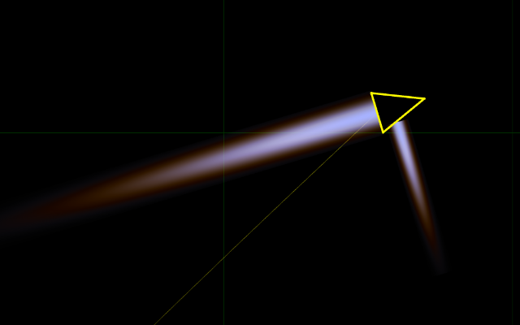
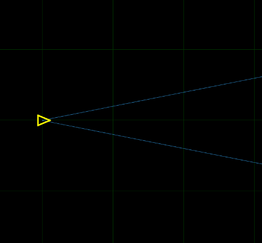
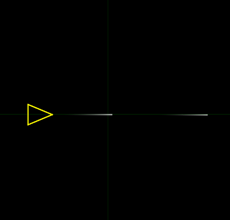
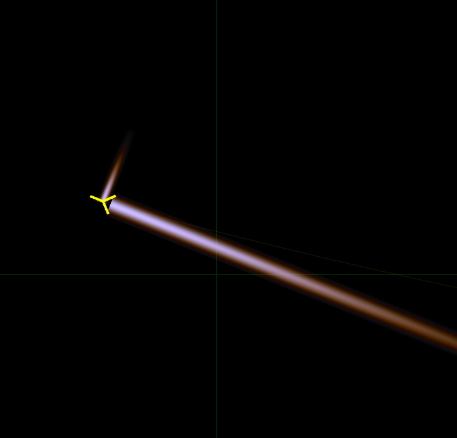
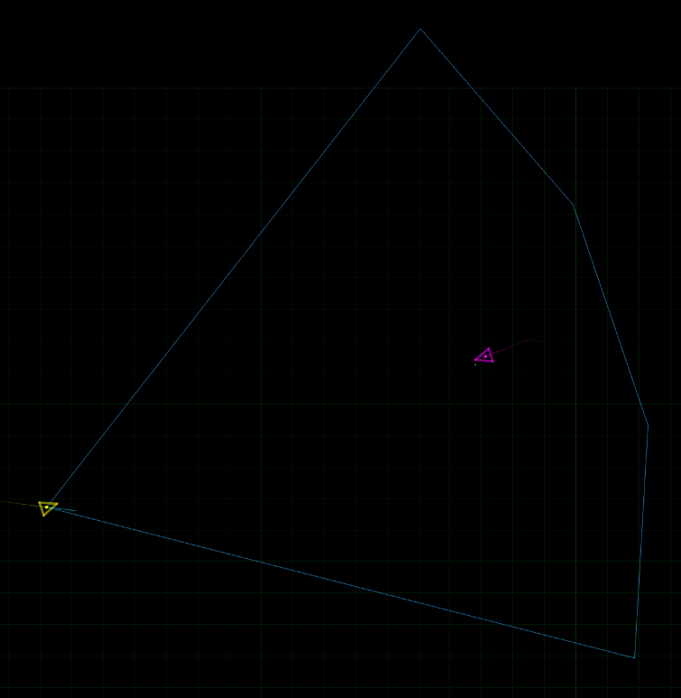
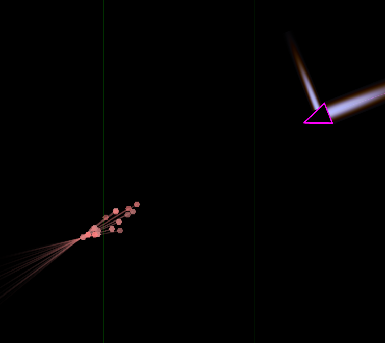
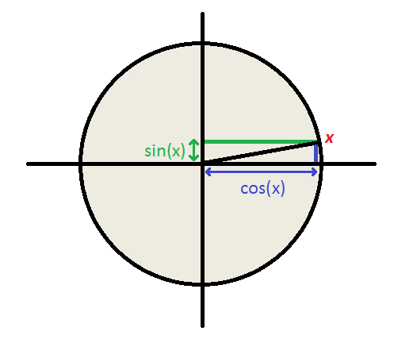

<!-- _paginate: false-->
<!-- _footer: oct.25 2024-->

# :artificial_satellite: **OORT.RS** :rocket:
## Squadron Bêta
Marty Hugo & Rouiller Cyril

---
# Introduction

- [oort.rs](https://oort.rs) est un jeu de programmation qui utilise le language Rust afin de contrôler une flotte de vaisseaux dans différents défis et duels.

---
# Introduction

- Le tournois se déroulant sur le duel de fighter.

- Nous avons donc utilisé son programme par défaut comme base, puis nous l'avons amélioré jusqu'à l'amener dans le leaderboard.

---
# Sommaire
- Introduction
- Équipements
- R&D
- Comportements
    - Modes / États
    - Mouvements
- Conclusion

---
# Équipements
- Notre vaisseau dispose de cinq éléments:
    - des réacteurs
    - un radar
    - une radio
    - une mitrailleuse
    - des missiles

---
### Équipements : *Réacteurs*
Les réacteurs permettent au vaisseau de se déplacer dans l'espace ainsi que d'effectuer des rotations sur lui même.

---
### Équipements : *Radar*
Le radar est un outil qui donne la possibilité de scanner dans une direction donnée. Il renvoie ensuite les coordonées et la vélocité du contact ennemi.

---
### Équipements : *Radio*
La radio est un élément invisible qui nous permet d'envoyer et de recevoir des messages sur un canal choisi.
Les canaux sont communs au deux équipes.

---
### Équipements : *Mitrailleuse*
La mitrailleuse permet au vaisseau de tirer des balles qui sont des projectiles, elles ne sont plus controlables une fois tirées.

---
### Équipements : *Missiles*
Les missiles agissent comme des mini vaisseaux, ils sont dirigeables et comportent la radio ainsi que le radar.

---
# R&D
- À partir du code de base, nous avons amélioré les éléments suivants:
    - Radar
    - Radio
    - Missiles

---
### R&D : *Radar*
- Le radar a été amélioré afin de se redimentionner de manière à être le plus large tout en gardant une distance de sécutité derrière l'ennemi

---
### R&D : *Radar pt2*
- Le radar ne disposant de méthode que pour donner la largeur un calcul a été fait.
- Nous avons donc fait notre propre méthode qui donne la largeur du radar en prenant en paramètres sa longeur.
- Formule : 1 - ((((distance_voulue * 1.25) - 20'000) / 10)  * 0.00125)

---
### R&D : *Radio*
- La radio quand à elle change desormais de canal à chaque tick afin de ne pas se faire écraser par un potentiel ennemi qui utiliserai le même.

---
### R&D : *Missiles*
- Les missiles font des calculs pour exploser cent millisecondes avant de toucher l'ennemi.
- En faisant cela les débris augmentent la chances de toucher l'ennemi en lui infligeant tout autant de dégats.

---
# Comportement
Le vaisseau comporte trois états.

---
### Attaque
- En mode **attaque**, le vaisseau fait rotationner son radar afin de balayer l'horizon et se dirige vers la dernière position connue de l'ennemi.
- Si il y trouve un ennemi de type *"fighter"* il lui lance un missile et communique sa position par radio à tous les missiles.
- Tous les 30 ticks le vaisseau passe en mode **recherche**

---
### Recherche
- Le vaisseau va mettre son radar le plus large possible (un quart) et va faire un tour de scan en 4 ticks
- Si un missile est détecté, le vaisseau passe en mode **défense**
- Sinon il retourne en mode **attaque**

---
### Défense
- En mode **défense**, le vaisseau va cibler le missile trouvé en recherche et essayer de le détruire
- Si le missile est détruit, perdu de vue ou nous passe à coté *(plus de 90° de différense avec l'ennemi)* on retourne en **recherche**

---
### Mouvements
- Le vaisseau suit deux comportements :
    - en **recherche** et **défense** on se laisse porter
    - en **attaque** on utilise la fonction ***unpredictible_trajectory***

---
### *Unpredictible trajectory*
- Cette fonction est basée sur *"seek"* à la différence que nous utilisont comme point où se diriger notre position actuelle additionnée à :
- (en x) le cosinus de la distance entre nous et l'ennemi
- (en y) le sinus de la distance à laquelle nous souhaitons passer

---
# Conclusion
- Codage de vaisseau interessant
- Meilleures compréhension de la trigonométrie
- Quand-même trop de maths
- Classement pas mauvais :wink:

---
# Questions ?